# LaundryLane 🧺

A modern Flutter application for laundry and dry cleaning services. LaundryLane provides users with a seamless experience to book, manage, and track their laundry orders with an intuitive and user-friendly interface.

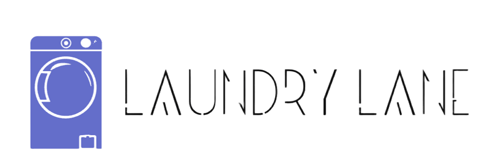

## 📱 App Screenshots

### User Interface & Features

<div align="center">

#### Welcome & Authentication
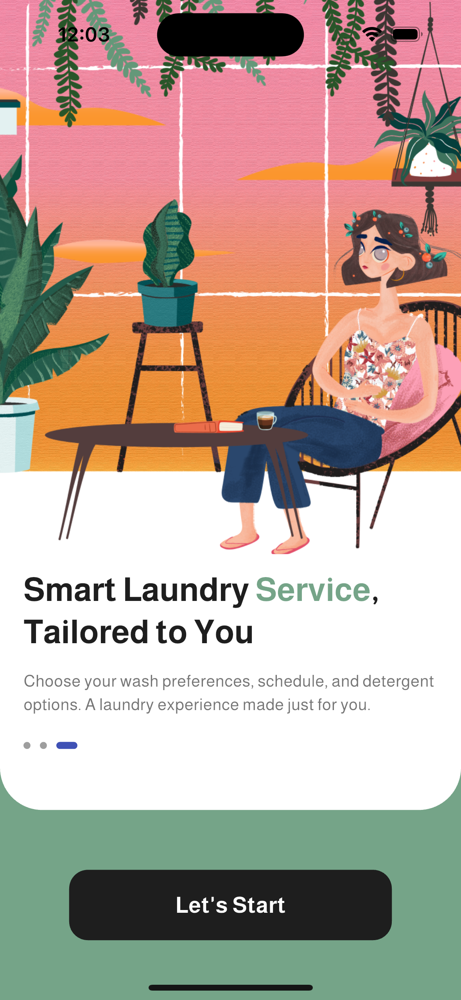 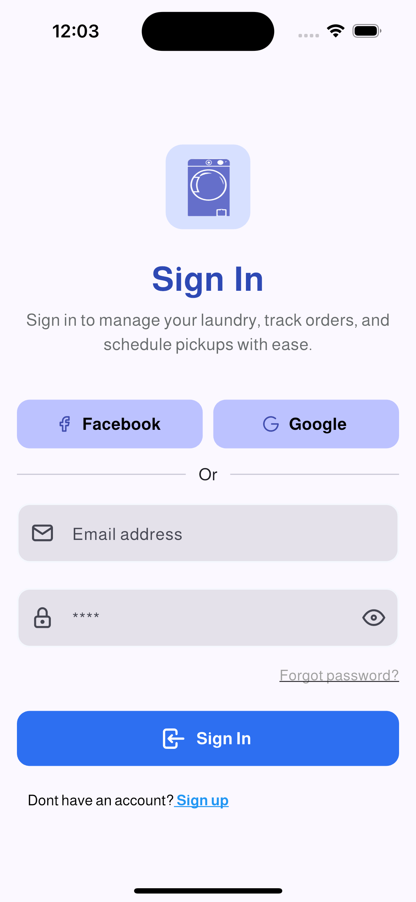

#### Home & Navigation
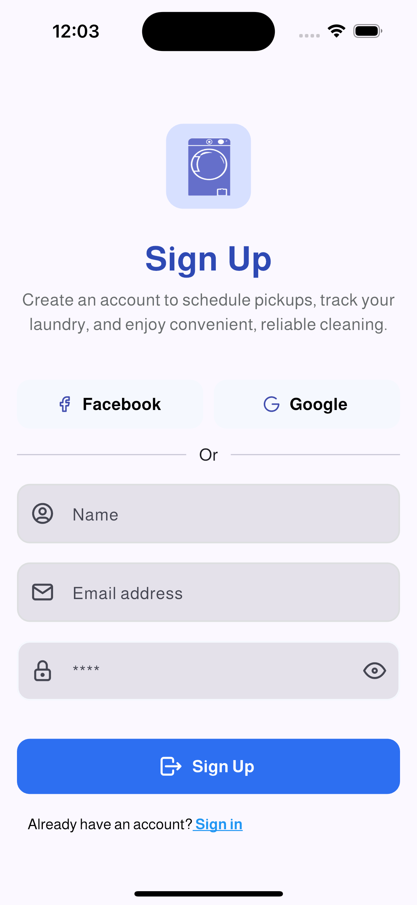 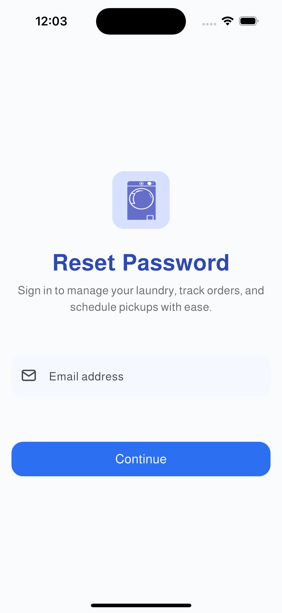

#### Shopping & Checkout
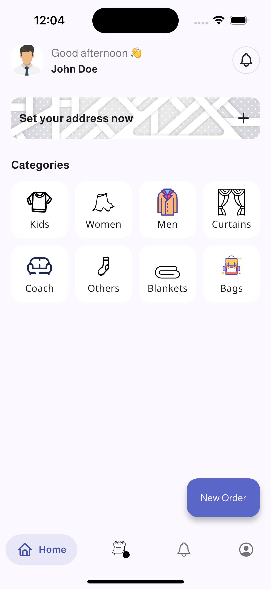 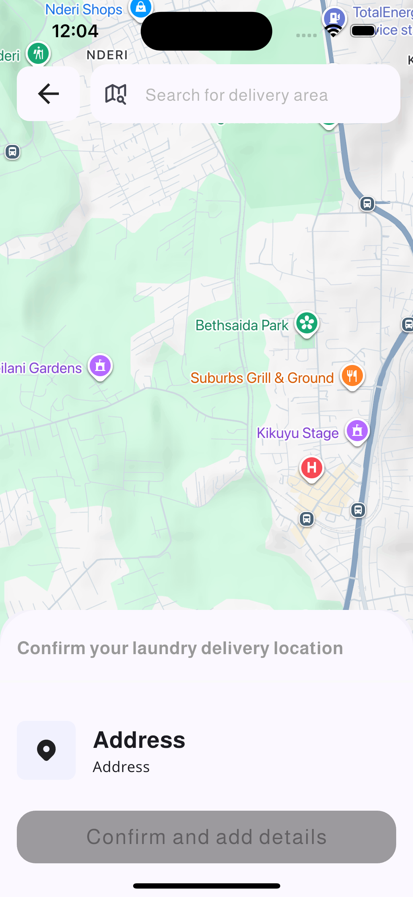

#### Payment & Tracking
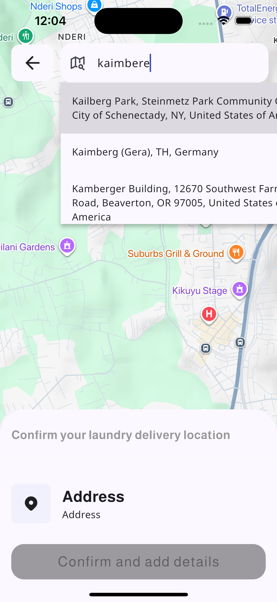 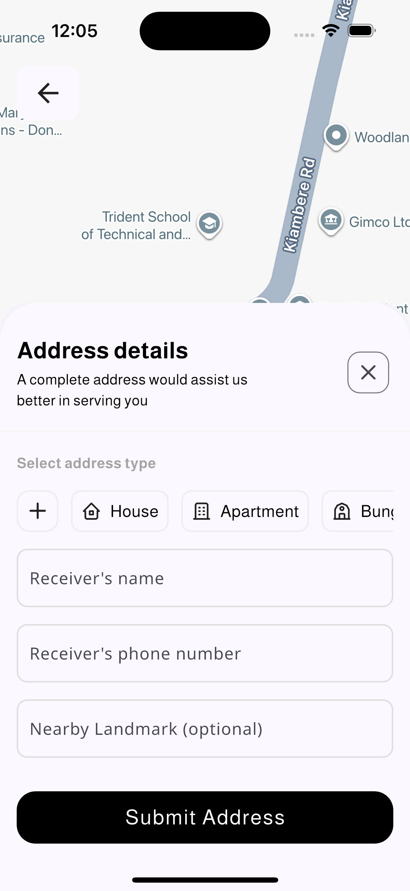

#### Profile & Settings
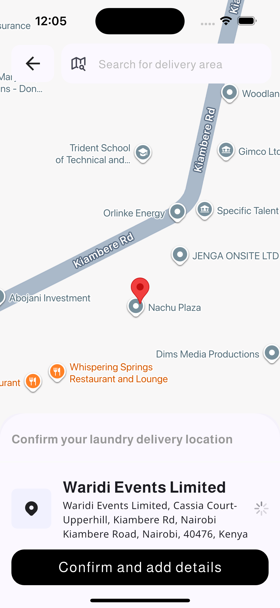 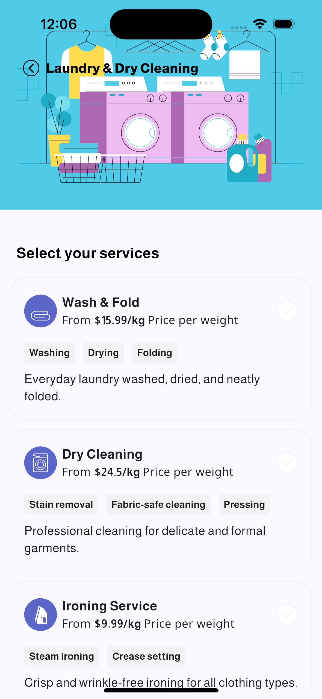

#### Communication & History
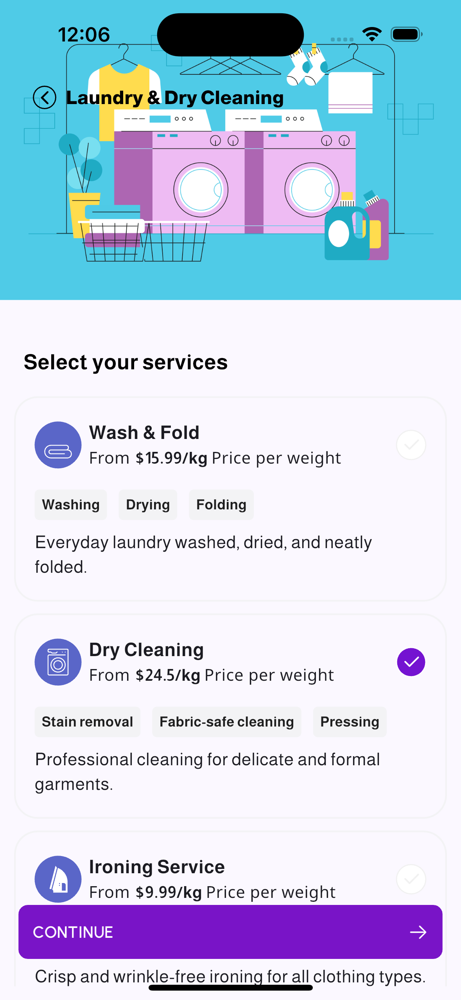 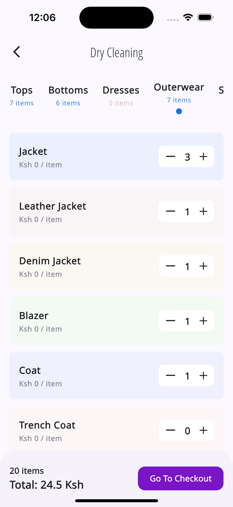

#### Services & Support
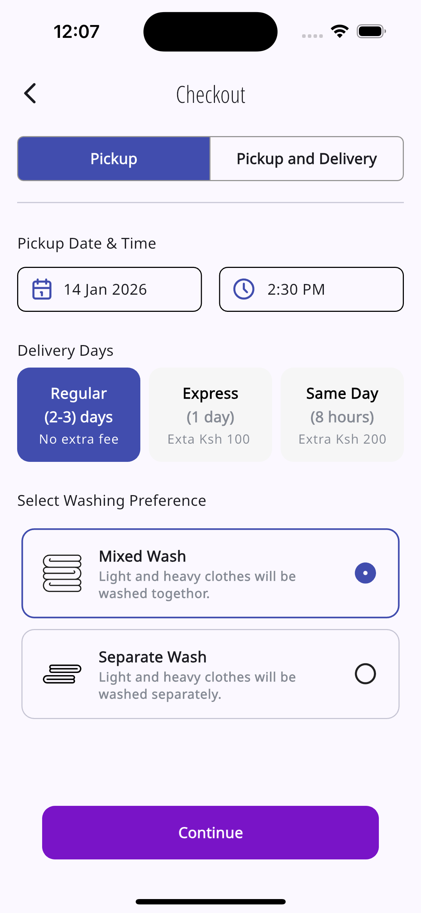 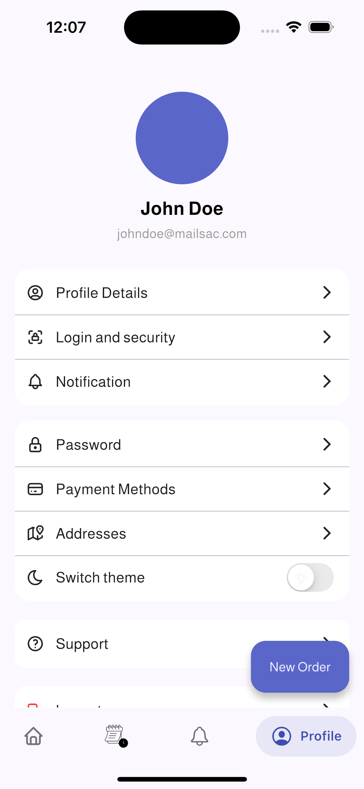

#### Configuration & Features
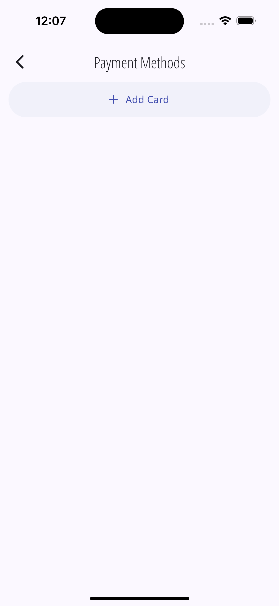 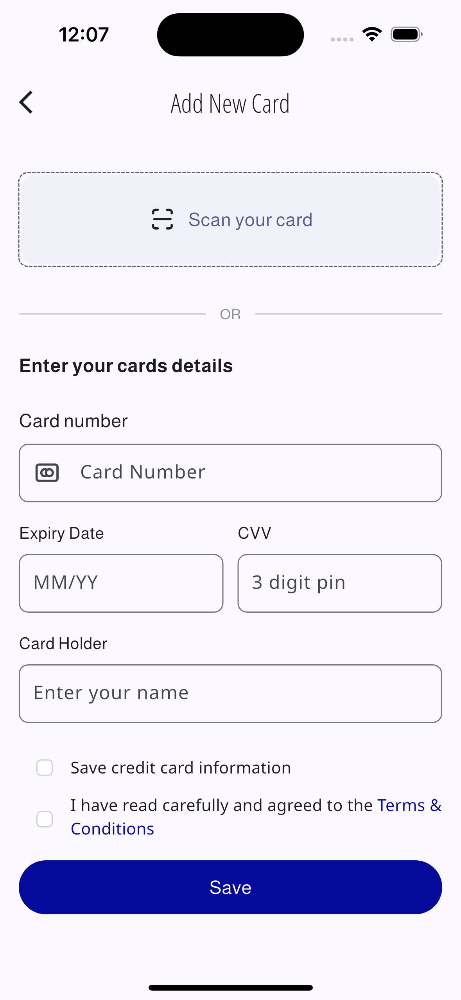 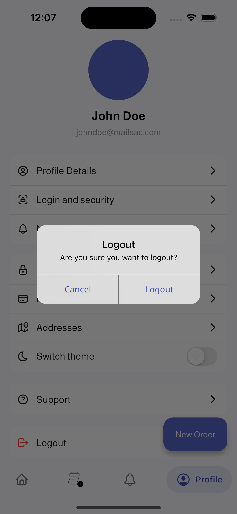

</div>

### 📋 Screen Descriptions

- **Welcome & Onboarding** - Initial app introduction and user onboarding flow
- **Authentication** - Login and registration screens with modern UI
- **Home Dashboard** - Main dashboard with quick access to all features
- **Service Selection** - Browse and select laundry services (wash, dry clean, ironing)
- **Cart Management** - Add items to cart and manage quantities
- **Checkout** - Complete order with delivery preferences
- **Payment Integration** - Secure payment processing with multiple options
- **Order Tracking** - Real-time status updates for placed orders
- **User Profile** - Manage account settings and preferences
- **Address Management** - Add and manage delivery addresses
- **Push Notifications** - Order updates and promotional notifications
- **Order History** - View past orders and reorder functionality
- **Service Details** - Detailed view of laundry services and pricing
- **Customer Support** - Help center and customer support features
- **App Settings** - Configure app preferences and account settings
- **Promotions & Offers** - Special deals and discount promotions
- **Delivery Tracking** - Real-time delivery tracking with map integration

## ✨ Features

### 🏠 **Home & Navigation**
- Intuitive bottom navigation with Salomon bottom bar
- Quick access to all major features
- Modern Material Design 3 UI components

### 👤 **User Management**
- Secure user authentication
- Profile management and customization
- Address book with multiple delivery locations

### 🛍️ **Service Booking**
- Comprehensive laundry services (wash, dry clean, ironing)
- Flexible scheduling options
- Real-time service availability

### 🛒 **Shopping & Cart**
- Smart cart management
- Quantity adjustments and item removal
- Price calculations with tax and delivery fees

### 💳 **Payment System**
- Multiple payment methods supported
- Secure payment processing
- Card management and storage

### 📦 **Order Management**
- Real-time order tracking
- Order history and reordering
- Status updates and notifications

### 🗺️ **Location Services**
- Google Maps integration
- Real-time delivery tracking
- Address validation and suggestions

### 🔔 **Notifications**
- Push notifications for order updates
- Promotional notifications
- Customizable notification preferences

## 🚀 Getting Started

### Prerequisites

- Flutter SDK (^3.7.2 or higher)
- Dart SDK (^3.0.0 or higher)
- Android Studio / VS Code with Flutter extensions
- iOS development tools (for iOS builds)
- Firebase project setup
- Google Maps API key

### Installation

1. **Clone the repository**
   ```bash
   git clone <repository-url>
   cd laundrylane
   ```

2. **Install dependencies**
   ```bash
   flutter pub get
   ```

3. **Configure Firebase**
   - Create a new Firebase project at [Firebase Console](https://console.firebase.google.com/)
   - Add your Android and iOS apps to the Firebase project
   - Download configuration files:
     - Android: `google-services.json` → place in `android/app/`
     - iOS: `GoogleService-Info.plist` → place in `ios/Runner/`
   - Add `firebase.json` file to the project root:
   ```json
   {
     "flutter": {
       "platforms": {
         "android": {
           "default": {
             "projectId": "your-project-id",
             "appId": "your-app-id"
           }
         },
         "ios": {
           "default": {
             "projectId": "your-project-id",
             "appId": "your-app-id"
           }
         }
       }
     }
   }
   ```

4. **Configure Google Maps API**
   
   **For Android:**
   - Add your Google Maps API key to `android/app/src/main/res/values/strings.xml`:
   ```xml
   <resources>
       <string name="maps_key">YOUR_GOOGLE_MAPS_API_KEY_HERE</string>
   </resources>
   ```
   
   **For iOS:**
   - Create/Update `ios/Secrets.xcconfig` file:
   ```
   MAPS_KEY=YOUR_GOOGLE_MAPS_API_KEY_HERE
   ```
   

5. **Enable required APIs in Google Cloud Console**
   - Enable the following APIs for your project:
     - Maps SDK for Android
     - Maps SDK for iOS
     - Places API
     - Directions API

6. **Run the app**
   ```bash
   flutter run
   ```

### Building for Production

#### Android
```bash
flutter build apk --release
# or for App Bundle
flutter build appbundle --release
```

#### iOS
```bash
flutter build ios --release
```


1. **Security Best Practices**
   - Never commit API keys to version control
   - Use environment variables in CI/CD pipelines
   - Restrict API keys by domain/package name
   - Enable API key restrictions in Google Cloud Console
   - Use different API keys for development and production

### 📝 Required Configuration Files

Make sure these files exist in your project:

```
laundrylane/
├── firebase.json              # Firebase project configuration
├── android/app/
│   ├── google-services.json   # Firebase Android config
│   └── src/main/res/values/
│       └── strings.xml        # Android API keys
├── ios/
│   ├── Secrets.xcconfig       # iOS API keys
│   └── Runner/
│       ├── GoogleService-Info.plist  # Firebase iOS config
│       └── AppDelegate.swift  # iOS Maps initialization
```

## 🛠️ Technology Stack

### Core Dependencies
- **Flutter** (^3.7.2) - Cross-platform UI framework
- **Dart** (^3.0.0) - Programming language

### State Management
- **Riverpod** (^3.0.3) - Reactive state management
- **Provider** (^6.1.5+1) - State management alternative

### UI & Styling
- **Google Fonts** (^6.3.2) - Typography
- **Tabler Icons** (^2.5.0+1) - Icon library
- **Flutter SVG** (^2.2.2) - Vector graphics
- **Salomon Bottom Bar** (^3.3.2) - Navigation component
- **Smooth Page Indicator** (^1.2.1) - Page indicators

### Networking & APIs
- **Dio** (^5.9.0) - HTTP client
- **Firebase Core** (^4.2.1) - Firebase integration

### Forms & Validation
- **Flutter Form Builder** (^10.0.1) - Dynamic form creation
- **Form Builder Validators** (^11.1.2) - Form validation
- **ZXCVBN** (^1.0.0) - Password strength checker

### Location & Maps
- **Google Maps Flutter** (^2.1.1) - Maps integration

### Utilities
- **Shared Preferences** (^2.5.3) - Local storage
- **Shimmer** (^3.0.0) - Loading animations
- **Dotted Border** (^3.1.0) - Decorative borders
- **Jiffy** (^6.3.2) - Date/time utilities
- **Easy Stepper** (^0.8.5+1) - Stepper components

## 📁 Project Structure

```
lib/
├── main.dart                 # App entry point
├── models/                   # Data models
│   ├── auth_response.dart
│   ├── catalog_model.dart
│   ├── clothing_type.dart
│   └── ...
├── providers/                # State management
│   ├── card_provider.dart
│   └── token_provider.dart
├── src/                      # Main source code
│   ├── apis/                # API services
│   ├── app.dart             # App configuration
│   ├── authentication/      # Auth screens
│   ├── cart/               # Shopping cart
│   ├── checkout/           # Checkout process
│   ├── home/               # Home dashboard
│   ├── onboarding/         # User onboarding
│   ├── payments/           # Payment handling
│   └── ...
├── widgets/                 # Reusable widgets
└── theme/                   # App theming
```

## 🌐 Platform Support

| Platform | Status | Notes |
|----------|--------|--------|
| Android  | ✅ Supported | API level 21+ (Android 5.0) |
| iOS      | ✅ Supported | iOS 11.0+ |
| Web      | ⚠️ Partial | Core features supported |
| macOS    | ⚠️ Partial | Basic functionality |
| Windows  | ⚠️ Partial | Basic functionality |
| Linux    | ⚠️ Partial | Basic functionality |

## 🎨 Design System

The app follows Material Design 3 principles with:
- **Primary Color**: Blue theme
- **Typography**: Google Fonts (Inter family)
- **Icons**: Tabler Icons for consistency
- **Components**: Custom-built reusable widgets

## 🔒 Security Features

- Secure authentication with token-based session management
- Input validation and sanitization
- Secure payment processing
- HTTPS communication for all API calls
- Local data encryption for sensitive information

## 📈 Performance Optimizations

- Lazy loading for large lists
- Image optimization and caching
- Efficient state management with Riverpod
- Minimal widget rebuilds
- Optimized animations and transitions

## 🧪 Testing

Run tests with:
```bash
flutter test
```

For integration testing:
```bash
flutter test integration_test/
```

## 📄 License

This project is licensed under the MIT License - see the [LICENSE](LICENSE) file for details.

## 🤝 Contributing

1. Fork the repository
2. Create a feature branch (`git checkout -b feature/amazing-feature`)
3. Commit your changes (`git commit -m 'Add amazing feature'`)
4. Push to the branch (`git push origin feature/amazing-feature`)
5. Open a Pull Request

### Development Guidelines

- Follow Flutter's style guide
- Write tests for new features
- Update documentation as needed
- Use meaningful commit messages

## 📞 Support

For support and questions:
- Create an issue on GitHub
- Email: support@laundrylane.com
- Documentation: [Project Wiki](wiki-url)

## 🙏 Acknowledgments

- Flutter team for the amazing framework
- Contributors to the open-source packages used
- Design inspiration from Material Design 3

---

**LaundryLane** - Making laundry services accessible and convenient for everyone 🧺✨
